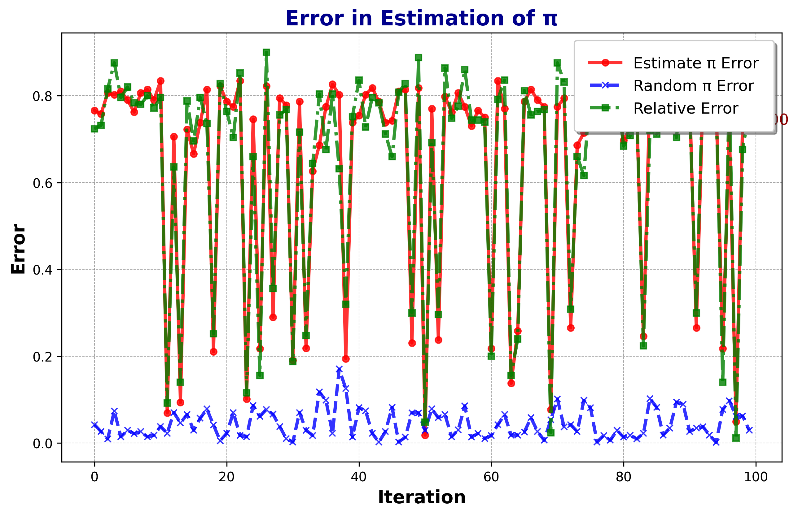

# **PRNG** - A Pseudo-Random Number Generator in Python 🧮✨  


This project implements a **Pseudo-Random Number Generator (PRNG)** in Python3. It uses a middle-square method to generate pseudo-random numbers and includes a Monte Carlo simulation for estimating π. The results are visualized using `matplotlib`.  
- This Project was part of the course `Introduction to Software Systems` at **IIIT Hyderabad**.
---

## **📜 Project Overview**  

### **✨ Main Features**  
- **🛠️ Custom Pseudo-Random Number Generator:**  
  A deterministic approach to generating pseudo-random numbers with user-defined seed and iterations.  
- **📊 Monte Carlo Simulation for π Estimation:**  
  Uses generated pseudo-random numbers to estimate the value of π.  
- **📈 Visualization:**  
  Frequency distribution of random numbers and error analysis in π estimation.  

---

## **📂 Directory Structure**  
```  
PRNG/  
├── estimation_of_pie.png                # 📊 Graph: Error in π estimation  
├── estimation_of_pie.py                 # 🧮 Monte Carlo π estimation script  
├── estimation_of_pi_improved.png        # 📈 Improved graph: Error in π estimation  
├── Final_results.png                    # 🏁 Final Estimation Result 
├── pseudo_random_generator.py           # 🎲 PRNG implementation  
├── README.md                            # 📖 Documentation file  
└── __pycache__/                         # ⚙️  Compiled Python files  
```  

---

## **🚀 How to Run**  

### **1️⃣ Clone the Repository**  
```bash  
git clone https://github.com/shreyasMehta05/PRNG.git  
cd PRNG  
```  

### **2️⃣ Install Required Libraries**  
Ensure you have Python 3 installed. Install the dependencies using:  
```bash  
pip install matplotlib  
```  

### **3️⃣ Run the Pseudo-Random Generator**  
Generate and visualize a frequency distribution of pseudo-random numbers:  
```bash  
python3 pseudo_random_generator.py  
```  

### **4️⃣ Estimate π Using Monte Carlo Simulation**  
Estimate the value of π using the generated pseudo-random numbers:  
```bash  
python3 estimation_of_pie.py  
```  

---

## **🎲 Pseudo-Random Generator (`pseudo_random_generator.py`)**  

This script generates `k` pseudo-random numbers using the middle-square method.  

### **⚙️ Usage**  
- Input the **number of digits** for the seed.  
- Input the **number of random numbers** to generate.  

### **🔑 Key Functionality**  
- **`pseudoRandNumGen(seed, k)`**:  
  Generates a list of `k` pseudo-random numbers based on the given seed.  
- **📊 Visualization:**  
  Outputs a histogram of the random number distribution.  

---

## **📊 Monte Carlo Simulation for π Estimation (`estimation_of_pie.py`)**  

This script estimates the value of π using the Monte Carlo method. It compares two approaches:  
1. **Custom Pseudo-Random Number Generator** (`PRNG`).  
2. **Python’s Built-in Random Library** (`random`).  

### **✨ Key Features**  
- **📐 Monte Carlo Algorithm:**  
  Uses random points within a square to calculate π.  
- **📈 Visualization:**  
  - Error in π estimation using custom PRNG and Python's `random`.  
  - Relative error comparison.  

---

## **📷 Visualization Examples**  

### **1️⃣ Frequency Distribution of Pseudo-Random Numbers**  
  
_Histogram showing the frequency distribution of generated random numbers._  

### **2️⃣ Error in Estimation of π**  
  
_Comparison of errors using custom PRNG and Python’s `random`._  

---

## **📋 Functions Overview**  

### **`pseudo_random_generator.py`**  
- **`numberOfDigits(n)`**:  
  Returns the number of digits in a given number.  
- **`pseudoRandNumGen(seed, k)`**:  
  Core function to generate pseudo-random numbers using the middle-square method.  

### **`estimation_of_pie.py`**  
- **`generate(k)`**:  
  Generates two sets of pseudo-random numbers (`x` and `y`) for Monte Carlo simulation.  
- **`inSquare(l)`**:  
  Maps generated points to a unit square.  
- **`estimate_pi(l)`**:  
  Estimates π using points within a circle.  
- **`estimate_pi_using_random(l)`**:  
  Estimates π using Python’s `random`.  
- **`estimate_pi_error(l)`**:  
  Calculates the absolute error in π estimation.  

---

## **📊 Results**  
- **✅ Closest Estimate to π (Custom PRNG):**  
  Closest calculated value of π: **`3.141`**  
- **📈 Visualization of Errors:**  
  Demonstrates the effectiveness of the custom PRNG compared to Python's built-in `random` library.
- **🏁 Final Results:**  
    
---

## **📦 Dependencies**  
- **🐍 Python 3**  
- **📊 `matplotlib`** (for visualizations)  

---

## **👨‍💻 Author**  
- **Shreyas Mehta**  

---
